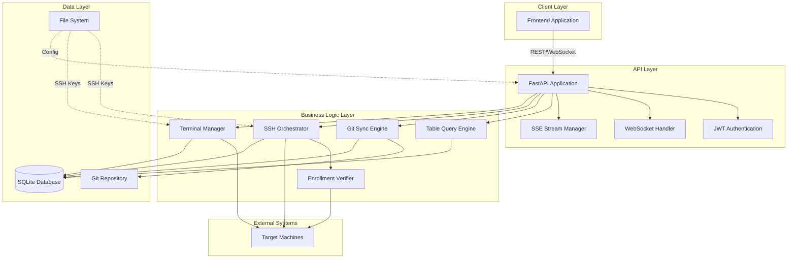

# Design Document: LinkOps Backend API

## Overview

The LinkOps Backend API is a FastAPI-based asynchronous service that provides secure SSH orchestration, bash script execution, and real-time monitoring capabilities. The system follows a table-based API design pattern inspired by Excel spreadsheets, where each data entity is exposed through a unified query interface. The architecture emphasizes security through enrollment verification, ensuring that only machines with matching client IDs can execute operations.

The API serves as the backend for a completed frontend application with four main tabs (Overview, Links, Operations, Terminal). It integrates with a private Git repository for configuration management, uses JWT for authentication, Server-Sent Events for real-time operation monitoring, and WebSockets for interactive terminal sessions.

## Architecture

### High-Level Architecture



### Component Responsibilities

**API Layer:**
- **FastAPI Application**: Main application entry point, route definitions, middleware configuration
- **JWT Authentication**: Token generation, validation, and middleware for protected endpoints
- **WebSocket Handler**: Manages WebSocket connections for terminal sessions
- **SSE Stream Manager**: Manages Server-Sent Event streams for operation monitoring

**Business Logic Layer:**
- **Table Query Engine**: Processes unified table queries with filtering, sorting, and pagination
- **Git Sync Engine**: Clones/pulls Git repository, parses YAML files, updates database
- **SSH Orchestrator**: Executes bash scripts on target machines, manages concurrency, captures output
- **Enrollment Verifier**: Validates target machines have matching client ID files
- **Terminal Manager**: Manages multi-pane terminal workspaces and SSH PTY sessions

**Data Layer:**
- **SQLite Database**: Stores machines, operations, scripts, terminal sessions
- **File System**: Stores SSH keys, configuration files, logs
- **Git Repository**: Source of truth for inventory (links.yaml) and scripts (scripts.yaml)

### Technology Stack

- **Framework**: FastAPI 0.104+ (async ASGI framework)
- **SSH Library**: asyncssh 2.14+ (async SSH client)
- **Git Library**: GitPython 3.1+ (Git operations)
- **Database**: SQLite 3 with aiosqlite (async SQLite driver)
- **Authentication**: python-jose[cryptography] (JWT tokens)
- **Server**: uvicorn (ASGI server)
- **YAML Parser**: PyYAML 6.0+
- **Async Runtime**: asyncio (Python standard library)

## Components and Interfaces

### 1. Authentication Module

**Purpose**: Handles user authentication and JWT token management.

**Interface:**
```python
class AuthService:
    async def authenticate(username: str, password: str) -> AuthResult:
        """
        Authenticate user credentials and return JWT token.
        
        Returns:
            AuthResult with token, user info, or error details
        """
        pass
    
    async def validate_token(token: str) -> TokenValidation:
        """
        Validate JWT token signature and expiration.
        
        Returns:
            TokenValidation with user info or error
        """
        pass
    
    async def check_lockout(username: str) -> LockoutStatus:
        """
        Check if user account is locked due to failed attempts.
        
        Returns:
            LockoutStatus with locked flag and unlock time
        """
        pass
    
    async def record_failed_attempt(username: str) -> None:
        """Record failed authentication attempt."""
        pass
```

**Data Structures:**
```python
@dataclass
class AuthResult:
    success: bool
    token: Optional[str]
    user: Optional[dict]
    error: Optional[str]

@dataclass
class TokenValidation:
    valid: bool
    user: Optional[dict]
    error: Optional[str]

@dataclass
class LockoutStatus:
    locked: bool
    unlock_at: Optional[datetime]
    attempts: int
```

### 2. Git Sync Engine

**Purpose**: Synchronizes configuration from private Git repository and updates database.

**Interface:**
```python
class GitSyncEngine:
    async def sync_repository() -> SyncResult:
        """
        Clone or pull the configured Git repository.
        
        Returns:
            SyncResult with success status and details
        """
        pass
    
    async def parse_links_yaml(content: str) -> List[Link]:
        """
        Parse links.yaml and return Link objects.
        
        Returns:
            List of Link objects or raises ParseError
        """
        pass
    
    async def parse_scripts_yaml(content: str) -> List[Script]:
        """
        Parse scripts.yaml and return Script objects.
        
        Returns:
            List of Script objects or raises ParseError
        """
        pass
    
    async def update_database(links: List[Link], scripts: List[Script]) -> None:
        """Update database with parsed configuration."""
        pass
```

**Data Structures:**
```python
@dataclass
class SyncResult:
    success: bool
    commit_hash: Optional[str]
    timestamp: datetime
    error: Optional[str]

@dataclass
class Link:
    id: str
    name: str
    type: str  # VPS, Proxmox, VM
    provider: str
    host: str
    port: int
    user: str
    tags: List[str]
    enrollment_required: bool
    client_id: str
    ssh_key_ref: str
    proxy_jump: Optional[str]

@dataclass
class Script:
    id: str
    name: str
    description: str
    path: str
    flags: List[str]
    estimated_duration: int
```

### 3. Enrollment Verifier

**Purpose**: Validates that target machines have matching client ID files.

**Interface:**
```python
class EnrollmentVerifier:
    async def verify_enrollment(link: Link) -> EnrollmentResult:
        """
        Connect to target machine and verify client ID file.
        
        Returns:
            EnrollmentResult with enrollment status
        """
        pass
    
    async def read_client_id(ssh_connection) -> str:
        """
        Read /etc/linkops/client_id from target machine.
        
        Returns:
            Client ID string or raises FileNotFoundError
        """
        pass
    
    async def verify_batch(links: List[Link]) -> Dict[str, EnrollmentResult]:
        """
        Verify enrollment for multiple machines concurrently.
        
        Returns:
            Dictionary mapping link IDs to EnrollmentResult
        """
        pass
```

**Data Structures:**
```python
@dataclass
class EnrollmentResult:
    enrolled: bool
    client_id_found: bool
    client_id_matches: bool
    error: Optional[str]
    verified_at: datetime
```

### 4. SSH Orchestrator

**Purpose**: Executes bash scripts on target machines with concurrency control.

**Interface:**
```python
class SSHOrchestrator:
    async def execute_operation(operation: Operation) -> OperationResult:
        """
        Execute scripts on target machines with concurrency control.
        
        Returns:
            OperationResult with execution details
        """
        pass
    
    async def execute_script_on_target(
        script: Script,
        link: Link,
        flags: List[str]
    ) -> ExecutionResult:
        """
        Execute a single script on a single target.
        
        Returns:
            ExecutionResult with output and exit code
        """
        pass
    
    async def create_ssh_connection(link: Link) -> asyncssh.SSHClientConnection:
        """
        Create SSH connection to target machine.
        
        Returns:
            SSH connection object
        """
        pass
```

**Data Structures:**
```python
@dataclass
class Operation:
    id: str
    scripts: List[str]
    targets: List[str]
    flags: Dict[str, List[str]]
    concurrency: int
    require_enrollment: bool
    status: str  # queued, running, success, failed, partial
    started: Optional[datetime]
    ended: Optional[datetime]

@dataclass
class OperationResult:
    operation_id: str
    status: str
    success_count: int
    failed_count: int
    executions: List[ExecutionResult]

@dataclass
class ExecutionResult:
    target: str
    script: str
    exit_code: int
    stdout: str
    stderr: str
    duration: float
    started: datetime
    ended: datetime
```

### 5. Terminal Manager

**Purpose**: Manages multi-pane terminal workspaces with WebSocket connections.

**Interface:**
```python
class TerminalManager:
    async def create_workspace(layout: str, max_panes: int) -> Workspace:
        """
        Create a new terminal workspace.
        
        Returns:
            Workspace object with unique ID
        """
        pass
    
    async def assign_panes(
        workspace_id: str,
        panes: List[PaneAssignment]
    ) -> None:
        """Assign target machines to workspace panes."""
        pass
    
    async def connect_pane(workspace_id: str, pane_id: str) -> SSHSession:
        """
        Establish SSH PTY session for a pane.
        
        Returns:
            SSHSession object
        """
        pass
    
    async def handle_websocket(
        websocket: WebSocket,
        workspace_id: str
    ) -> None:
        """Handle WebSocket connection for terminal I/O."""
        pass
```

**Data Structures:**
```python
@dataclass
class Workspace:
    id: str
    layout: str  # single, grid2x2, grid1x3, grid2x1
    max_panes: int
    created_at: datetime
    panes: Dict[str, Pane]

@dataclass
class Pane:
    id: str
    target: Optional[str]
    connected: bool
    ssh_session: Optional[SSHSession]

@dataclass
class PaneAssignment:
    pane: str
    target: str

@dataclass
class SSHSession:
    connection: asyncssh.SSHClientConnection
    process: asyncssh.SSHClientProcess
    connected_at: datetime
```

### 6. Table Query Engine

**Purpose**: Processes unified table queries with filtering, sorting, and pagination.

**Interface:**
```python
class TableQueryEngine:
    async def query_table(query: TableQuery) -> TableResult:
        """
        Execute table query with filters, sorting, and pagination.
        
        Returns:
            TableResult with rows and metadata
        """
        pass
    
    async def validate_table(table_name: str) -> bool:
        """Validate that table name exists."""
        pass
    
    async def apply_filters(
        rows: List[dict],
        filters: List[Filter]
    ) -> List[dict]:
        """Apply filters to rows."""
        pass
    
    async def apply_sorting(
        rows: List[dict],
        sort: List[SortSpec]
    ) -> List[dict]:
        """Apply sorting to rows."""
        pass
```

**Data Structures:**
```python
@dataclass
class TableQuery:
    table: str
    columns: Optional[List[str]]
    filters: Optional[List[Filter]]
    sort: Optional[List[SortSpec]]
    page: Optional[PageSpec]

@dataclass
class Filter:
    col: str
    op: str  # eq, in, gt, lt, gte, lte
    val: Any

@dataclass
class SortSpec:
    col: str
    dir: str  # asc, desc

@dataclass
class PageSpec:
    size: int
    cursor: Optional[str]

@dataclass
class TableResult:
    table: str
    rows: List[dict]
    page: PageInfo
    meta: dict

@dataclass
class PageInfo:
    size: int
    next_cursor: Optional[str]
```

## Data Models

### Database Schema

**machines table:**
```sql
CREATE TABLE machines (
    id TEXT PRIMARY KEY,
    name TEXT NOT NULL,
    type TEXT NOT NULL,
    provider TEXT,
    icon TEXT,
    host TEXT NOT NULL,
    port INTEGER NOT NULL,
    user TEXT NOT NULL,
    proxy_jump TEXT,
    ssh_key_ref TEXT NOT NULL,
    tags TEXT,  -- JSON array
    enrollment_required BOOLEAN NOT NULL,
    client_id TEXT NOT NULL,
    enrolled BOOLEAN DEFAULT FALSE,
    enrollment_verified_at TIMESTAMP,
    status TEXT DEFAULT 'unknown',
    reachable BOOLEAN DEFAULT FALSE,
    latency INTEGER,
    last_seen TIMESTAMP,
    created_at TIMESTAMP DEFAULT CURRENT_TIMESTAMP,
    updated_at TIMESTAMP DEFAULT CURRENT_TIMESTAMP
);
```

**scripts table:**
```sql
CREATE TABLE scripts (
    id TEXT PRIMARY KEY,
    name TEXT NOT NULL,
    emoji TEXT,
    description TEXT,
    path TEXT NOT NULL,
    flags TEXT,  -- JSON array
    estimated_duration INTEGER,
    created_at TIMESTAMP DEFAULT CURRENT_TIMESTAMP,
    updated_at TIMESTAMP DEFAULT CURRENT_TIMESTAMP
);
```

**operations table:**
```sql
CREATE TABLE operations (
    id TEXT PRIMARY KEY,
    scripts TEXT NOT NULL,  -- JSON array
    targets TEXT NOT NULL,  -- JSON array
    flags TEXT,  -- JSON object
    concurrency INTEGER DEFAULT 5,
    require_enrollment BOOLEAN DEFAULT TRUE,
    status TEXT NOT NULL,
    started TIMESTAMP,
    ended TIMESTAMP,
    duration INTEGER,
    success_count INTEGER DEFAULT 0,
    failed_count INTEGER DEFAULT 0,
    created_at TIMESTAMP DEFAULT CURRENT_TIMESTAMP
);
```

**operation_logs table:**
```sql
CREATE TABLE operation_logs (
    id INTEGER PRIMARY KEY AUTOINCREMENT,
    operation_id TEXT NOT NULL,
    target TEXT NOT NULL,
    script TEXT NOT NULL,
    exit_code INTEGER,
    stdout TEXT,
    stderr TEXT,
    duration REAL,
    started TIMESTAMP,
    ended TIMESTAMP,
    FOREIGN KEY (operation_id) REFERENCES operations(id)
);
```

**terminal_workspaces table:**
```sql
CREATE TABLE terminal_workspaces (
    id TEXT PRIMARY KEY,
    layout TEXT NOT NULL,
    max_panes INTEGER NOT NULL,
    created_at TIMESTAMP DEFAULT CURRENT_TIMESTAMP,
    closed_at TIMESTAMP
);
```

**terminal_panes table:**
```sql
CREATE TABLE terminal_panes (
    id INTEGER PRIMARY KEY AUTOINCREMENT,
    workspace_id TEXT NOT NULL,
    pane_id TEXT NOT NULL,
    target TEXT,
    connected BOOLEAN DEFAULT FALSE,
    connected_at TIMESTAMP,
    disconnected_at TIMESTAMP,
    FOREIGN KEY (workspace_id) REFERENCES terminal_workspaces(id)
);
```

**auth_attempts table:**
```sql
CREATE TABLE auth_attempts (
    id INTEGER PRIMARY KEY AUTOINCREMENT,
    username TEXT NOT NULL,
    success BOOLEAN NOT NULL,
    ip_address TEXT,
    attempted_at TIMESTAMP DEFAULT CURRENT_TIMESTAMP
);
```

**git_sync_history table:**
```sql
CREATE TABLE git_sync_history (
    id INTEGER PRIMARY KEY AUTOINCREMENT,
    commit_hash TEXT,
    success BOOLEAN NOT NULL,
    error TEXT,
    synced_at TIMESTAMP DEFAULT CURRENT_TIMESTAMP
);
```

### API Request/Response Models

**Authentication:**
```python
class LoginRequest(BaseModel):
    username: str
    password: str

class LoginResponse(BaseModel):
    success: bool
    token: Optional[str]
    user: Optional[dict]
    error: Optional[str]
```

**Table Query:**
```python
class TableQueryRequest(BaseModel):
    table: str
    columns: Optional[List[str]] = None
    filters: Optional[List[dict]] = None
    sort: Optional[List[dict]] = None
    page: Optional[dict] = None

class TableQueryResponse(BaseModel):
    table: str
    rows: List[dict]
    page: dict
    meta: dict
```

**Operations:**
```python
class OperationRunRequest(BaseModel):
    scripts: List[str]
    flags: Optional[Dict[str, List[str]]] = {}
    targets: List[str]
    concurrency: int = 5
    require_enrollment: bool = True

class OperationRunResponse(BaseModel):
    operation_id: str
    status: str

class OperationStatusResponse(BaseModel):
    id: str
    scripts: List[str]
    targets: List[str]
    status: str
    started: Optional[datetime]
    ended: Optional[datetime]
    duration: Optional[int]
    result: dict
```

**Terminal:**
```python
class CreateWorkspaceRequest(BaseModel):
    layout: str
    max_panes: int

class CreateWorkspaceResponse(BaseModel):
    workspace_id: str

class AssignPanesRequest(BaseModel):
    panes: List[dict]  # [{"pane": "A", "target": "vps-01"}]

class WebSocketMessage(BaseModel):
    pane: str
    type: str  # stdin, stdout, stderr, status
    data: str
```

## API Endpoints

### Authentication Endpoints

**POST /api/auth/login**
- Request: `LoginRequest`
- Response: `LoginResponse`
- Description: Authenticate user and return JWT token

### Table Query Endpoints

**POST /api/tables/query**
- Request: `TableQueryRequest`
- Response: `TableQueryResponse`
- Description: Unified table query endpoint for all data tables
- Supported tables: `tbl_links`, `tbl_operations_history`, `tbl_recent_activity`, `tbl_infrastructure`, `tbl_link_health`

### Links Endpoints

**GET /api/links**
- Response: `List[dict]` (machine objects)
- Description: Get all machines from inventory

**GET /api/links/{link_id}**
- Response: `dict` (machine object)
- Description: Get specific machine details

**POST /api/links/{link_id}/verify**
- Response: `EnrollmentResult`
- Description: Verify machine enrollment status

### Operations Endpoints

**POST /api/operations/run**
- Request: `OperationRunRequest`
- Response: `OperationRunResponse`
- Description: Execute scripts on target machines

**GET /api/operations/{operation_id}**
- Response: `OperationStatusResponse`
- Description: Get operation status and results

**GET /api/operations/{operation_id}/events**
- Response: Server-Sent Events stream
- Description: Stream real-time operation events

**POST /api/operations/{operation_id}/stop**
- Response: `{"success": bool}`
- Description: Stop a running operation

### Terminal Endpoints

**POST /api/terminal/workspaces**
- Request: `CreateWorkspaceRequest`
- Response: `CreateWorkspaceResponse`
- Description: Create a new terminal workspace

**PUT /api/terminal/workspaces/{workspace_id}/panes**
- Request: `AssignPanesRequest`
- Response: `{"success": bool}`
- Description: Assign targets to workspace panes

**POST /api/terminal/workspaces/{workspace_id}/connect-all**
- Response: `{"success": bool}`
- Description: Connect all assigned panes

**WS /api/terminal/workspaces/{workspace_id}/ws**
- Protocol: WebSocket
- Messages: `WebSocketMessage`
- Description: WebSocket connection for terminal I/O

### Git Sync Endpoints

**GET /api/git/status**
- Response: `{"last_sync": datetime, "commit_hash": str, "status": str}`
- Description: Get Git sync status

**POST /api/git/sync**
- Response: `SyncResult`
- Description: Trigger Git repository sync

## Configuration

### Configuration File Structure

**/etc/linkops/config.ini:**
```ini
[api]
host = 0.0.0.0
port = 8000
jwt_secret = <generated-secret>
jwt_expiration_hours = 24

[database]
path = /var/lib/linkops/linkops.db

[git]
repository_url = git@github.com:sns-network/linkops-config.git
branch = main
local_path = /var/lib/linkops/git-repo
sync_interval_minutes = 15

[ssh]
keys_directory = /var/lib/linkops/keys
known_hosts_path = /var/lib/linkops/ssh/known_hosts
connection_timeout = 30
command_timeout = 300

[security]
max_failed_attempts = 5
lockout_duration_minutes = 5
enrollment_required = true

[logging]
level = INFO
path = /var/log/linkops/api.log
max_size_mb = 100
backup_count = 5
```

### File System Layout

```
/etc/linkops/
├── config.ini
└── secrets.ini (synced from Git, not in version control)

/var/lib/linkops/
├── linkops.db (SQLite database)
├── keys/
│   ├── sns_prod_ed25519 (600)
│   ├── sns_prod_ed25519.pub
│   └── ... (other SSH keys)
├── ssh/
│   └── known_hosts
├── git-repo/
│   ├── links.yaml
│   ├── scripts.yaml
│   ├── secrets.ini
│   └── scripts/
│       ├── baseline.sh
│       ├── install_crowdsec.sh
│       └── ... (other scripts)
└── logs/
    └── api.log

/var/log/linkops/
└── api.log (symlink to /var/lib/linkops/logs/api.log)
```


## Correctness Properties

*A property is a characteristic or behavior that should hold true across all valid executions of a system—essentially, a formal statement about what the system should do. Properties serve as the bridge between human-readable specifications and machine-verifiable correctness guarantees.*

### Property Reflection

After analyzing all acceptance criteria, several properties can be consolidated to eliminate redundancy:

- **Authentication properties (1.1, 1.2, 1.4, 1.5)** can be combined into comprehensive token lifecycle properties
- **Git sync properties (2.2, 2.3)** both test database updates and can be combined
- **YAML validation properties (2.4, 2.5)** follow the same pattern and can be generalized
- **Link query properties (3.1, 3.2, 3.3)** all test data retrieval and can be consolidated
- **Enrollment verification properties (4.3, 4.4, 4.5)** all test the same comparison logic with different outcomes
- **Operation execution properties (5.5, 5.6)** both test output capture and can be combined
- **SSE streaming properties (6.2, 6.3, 6.4)** all test event streaming and can be consolidated
- **WebSocket routing properties (7.4, 7.5, 7.6)** all test I/O forwarding and can be combined
- **Table query properties (8.2, 8.3, 8.4, 8.5)** all test query processing and can be consolidated
- **Health check properties (9.2, 9.3, 9.4, 9.5)** all test status updates and can be combined
- **Logging properties (12.1, 12.2, 12.3, 12.4)** all follow the same pattern and can be generalized

### Authentication Properties

**Property 1: JWT token generation and expiration**
*For any* valid credentials, authenticating should return a JWT token that expires exactly 24 hours from issuance and validates successfully before expiration.
**Validates: Requirements 1.1, 1.4**

**Property 2: Failed authentication increments counter**
*For any* invalid credentials, authentication attempts should increment the failed attempt counter and return an error.
**Validates: Requirements 1.2**

**Property 3: Expired or invalid tokens are rejected**
*For any* expired or malformed JWT token, API requests should return 401 Unauthorized.
**Validates: Requirements 1.5**

### Git Synchronization Properties

**Property 4: Git sync updates database**
*For any* successful Git sync operation, both links.yaml and scripts.yaml should be parsed and their contents should be reflected in the database.
**Validates: Requirements 2.1, 2.2, 2.3**

**Property 5: YAML validation rejects incomplete data**
*For any* YAML file (links.yaml or scripts.yaml) with missing required fields, parsing should fail with an error identifying the missing field.
**Validates: Requirements 2.4, 2.5**

**Property 6: Invalid YAML produces descriptive errors**
*For any* malformed YAML content, parsing should fail with an error identifying the invalid file and line number.
**Validates: Requirements 2.7**

### Inventory Management Properties

**Property 7: Links endpoint returns complete inventory**
*For any* database state, querying the links endpoint should return all machines with enrollment status, SSH configuration, and health metrics.
**Validates: Requirements 3.1, 3.3**

**Property 8: Link ID lookup returns correct machine**
*For any* valid link ID in the database, requesting that ID should return exactly that machine's details.
**Validates: Requirements 3.2**

**Property 9: Link filtering returns matching subset**
*For any* filter criteria (type, status, etc.), the results should contain only machines matching all specified criteria.
**Validates: Requirements 3.4**

**Property 10: Link sorting maintains order**
*For any* sort specification (column and direction), results should be ordered according to the specification, with ties broken consistently.
**Validates: Requirements 3.5**

### Enrollment Verification Properties

**Property 11: Enrollment verification compares client IDs**
*For any* machine with a client ID file, enrollment verification should mark the machine as enrolled if and only if the file contents match the inventory client ID.
**Validates: Requirements 4.3, 4.4, 4.5**

**Property 12: Enrollment failures return descriptive errors**
*For any* enrollment verification failure (missing file, SSH error, etc.), the result should include an error message describing the failure reason.
**Validates: Requirements 4.6**

### Script Execution Properties

**Property 13: Operations require enrollment**
*For any* operation submission, all target machines must be enrolled or the operation should be rejected with an error listing unenrolled targets.
**Validates: Requirements 5.1**

**Property 14: Valid operations create queued records**
*For any* operation with enrolled targets, submitting the operation should create a database record with status "queued" and return the operation ID.
**Validates: Requirements 5.2**

**Property 15: Only bash scripts are executed**
*For any* script with a non-bash interpreter (python, ruby, etc.), execution should be rejected with an error.
**Validates: Requirements 5.4**

**Property 16: Script execution captures output and metadata**
*For any* script execution, the system should capture stdout, stderr, exit code, and execution duration.
**Validates: Requirements 5.5, 5.6**

**Property 17: Operation status reflects execution results**
*For any* completed operation, the status should be "success" if all targets succeeded, "failed" if all failed, or "partial" if some succeeded.
**Validates: Requirements 5.7**

**Property 18: Concurrency limits parallel executions**
*For any* operation with concurrency N, at most N script executions should run in parallel at any given time.
**Validates: Requirements 5.8**

### Real-Time Monitoring Properties

**Property 19: SSE streams operation events**
*For any* running operation, connecting to the SSE endpoint should stream events for script output and completion status.
**Validates: Requirements 6.2, 6.3, 6.4**

**Property 20: SSE connections close on completion**
*For any* operation, when all scripts complete, the SSE connection should close automatically.
**Validates: Requirements 6.5**

### Terminal Session Properties

**Property 21: Workspace IDs are unique**
*For any* sequence of workspace creations, all generated workspace IDs should be unique.
**Validates: Requirements 7.1**

**Property 22: Pane assignments require enrollment**
*For any* pane assignment, the target machine must be enrolled or the assignment should be rejected.
**Validates: Requirements 7.2**

**Property 23: WebSocket routes I/O bidirectionally**
*For any* WebSocket connection, client input should be forwarded to the SSH session and SSH output should be forwarded to the client.
**Validates: Requirements 7.4, 7.5, 7.6**

**Property 24: Pane disconnection cleans up resources**
*For any* pane disconnection, the SSH session should be closed and all associated resources should be freed.
**Validates: Requirements 7.7**

### Table Query Properties

**Property 25: Table queries validate table names**
*For any* table query, if the table name does not exist, the query should be rejected with an error.
**Validates: Requirements 8.1**

**Property 26: Table queries apply filters, sorting, and pagination**
*For any* table query with filters, sorting, and pagination, the results should match all filters, be ordered correctly, and contain the requested page size.
**Validates: Requirements 8.2, 8.3, 8.4, 8.5**

**Property 27: Table queries include metadata**
*For any* table query, the response should include metadata with the query timestamp.
**Validates: Requirements 8.6**

### Health Monitoring Properties

**Property 28: Health checks update machine status**
*For any* machine, a successful health check should update status to "online" with latency and timestamp, while a failed check should update status to "offline".
**Validates: Requirements 9.2, 9.3, 9.4, 9.5**

### Configuration Properties

**Property 29: SSH key permissions are validated**
*For any* SSH key file, if the permissions are not 600, the system should reject the key with an error.
**Validates: Requirements 10.3**

**Property 30: Secrets parsing extracts configuration**
*For any* valid secrets.ini file, parsing should extract all key paths and tokens into the configuration.
**Validates: Requirements 10.4**

### Operation History Properties

**Property 31: Completed operations are stored**
*For any* completed operation, the full operation record including logs and results should be stored in the database.
**Validates: Requirements 11.1**

**Property 32: Operation history is sorted by time**
*For any* operation history query, results should be sorted by start time in descending order (newest first).
**Validates: Requirements 11.2**

**Property 33: Operation views include complete data**
*For any* operation ID, viewing the operation should return all execution logs and results for all targets.
**Validates: Requirements 11.3**

**Property 34: Operation filtering returns matching subset**
*For any* filter criteria (status, date range), the results should contain only operations matching all specified criteria.
**Validates: Requirements 11.4, 11.5**

### Error Handling Properties

**Property 35: Errors are logged with context**
*For any* error (SSH failure, Git failure, operation failure), the system should log the error with timestamp, context, and relevant details.
**Validates: Requirements 12.1, 12.2, 12.3, 12.4**

**Property 36: API errors return structured responses**
*For any* failed API request, the response should include a structured error object with an error code and message.
**Validates: Requirements 12.5**

### Service Management Properties

**Property 37: SIGTERM triggers graceful shutdown**
*For any* active connections, receiving SIGTERM should close all connections gracefully before the service exits.
**Validates: Requirements 13.2**

## Error Handling

### Error Categories

**Authentication Errors:**
- Invalid credentials (401)
- Account locked (403)
- Token expired (401)
- Token invalid (401)

**Validation Errors:**
- Missing required fields (400)
- Invalid field values (400)
- Invalid table name (400)
- Invalid filter operator (400)

**Enrollment Errors:**
- Machine not enrolled (403)
- Client ID file missing (404)
- Client ID mismatch (403)
- SSH connection failed (503)

**Operation Errors:**
- No enrolled targets (400)
- Script not found (404)
- Non-bash script (400)
- Execution timeout (504)
- Concurrency limit exceeded (429)

**Git Sync Errors:**
- Authentication failed (401)
- Repository not found (404)
- YAML parse error (400)
- Network error (503)

**Terminal Errors:**
- Workspace not found (404)
- Pane already assigned (409)
- Target not enrolled (403)
- SSH connection failed (503)

### Error Response Format

All API errors follow this structure:

```json
{
  "error": {
    "code": "ENROLLMENT_REQUIRED",
    "message": "Target machine vps-01 is not enrolled",
    "details": {
      "target": "vps-01",
      "client_id_found": false
    },
    "timestamp": "2026-01-27T17:30:00Z"
  }
}
```

### Error Handling Strategy

**Retry Logic:**
- SSH connections: 3 retries with exponential backoff
- Git sync: 2 retries with 5-second delay
- Database operations: No automatic retry (fail fast)

**Timeout Configuration:**
- SSH connection timeout: 30 seconds
- Script execution timeout: 300 seconds (5 minutes)
- WebSocket idle timeout: 3600 seconds (1 hour)
- SSE connection timeout: No timeout (client-controlled)

**Graceful Degradation:**
- If Git sync fails, use cached data from database
- If health check fails, mark machine as offline but allow manual operations
- If SSE connection drops, client can reconnect and resume from last event

## Testing Strategy

### Dual Testing Approach

The LinkOps backend requires both unit testing and property-based testing for comprehensive coverage:

**Unit Tests:**
- Specific examples demonstrating correct behavior
- Edge cases (empty inputs, boundary values, special characters)
- Error conditions (network failures, invalid data, permission errors)
- Integration points between components
- Example: Testing that exactly 5 failed login attempts triggers a 5-minute lockout

**Property-Based Tests:**
- Universal properties that hold for all inputs
- Comprehensive input coverage through randomization
- Minimum 100 iterations per property test
- Example: For any valid credentials, authentication returns a valid JWT token

### Property-Based Testing Configuration

**Library:** Hypothesis (Python property-based testing library)

**Test Configuration:**
```python
from hypothesis import given, settings, strategies as st

@settings(max_examples=100)
@given(
    username=st.text(min_size=1, max_size=50),
    password=st.text(min_size=1, max_size=100)
)
async def test_property_1_jwt_token_generation(username, password):
    """
    Feature: linkops-backend-api, Property 1: JWT token generation and expiration
    
    For any valid credentials, authenticating should return a JWT token
    that expires exactly 24 hours from issuance and validates successfully
    before expiration.
    """
    # Test implementation
    pass
```

**Tagging Convention:**
Each property test must include a docstring with:
- Feature name: `linkops-backend-api`
- Property number and title from design document
- Property statement (the "for any" statement)

**Test Organization:**
```
tests/
├── unit/
│   ├── test_auth.py
│   ├── test_git_sync.py
│   ├── test_ssh_orchestrator.py
│   ├── test_enrollment.py
│   └── test_terminal.py
├── property/
│   ├── test_auth_properties.py
│   ├── test_git_sync_properties.py
│   ├── test_ssh_orchestrator_properties.py
│   ├── test_enrollment_properties.py
│   └── test_terminal_properties.py
└── integration/
    ├── test_api_endpoints.py
    ├── test_websocket.py
    └── test_sse.py
```

### Test Data Generation

**Hypothesis Strategies:**
```python
# Machine/Link generation
@st.composite
def machine_strategy(draw):
    return {
        "id": draw(st.text(min_size=5, max_size=20)),
        "type": draw(st.sampled_from(["VPS", "Proxmox", "VM"])),
        "host": draw(st.ip_addresses(v=4).map(str)),
        "port": draw(st.integers(min_value=1, max_value=65535)),
        "user": draw(st.text(min_size=1, max_size=20)),
        "client_id": draw(st.uuids().map(lambda u: f"LINKOPS-{u}"))
    }

# Operation generation
@st.composite
def operation_strategy(draw):
    return {
        "scripts": draw(st.lists(st.text(min_size=1), min_size=1, max_size=10)),
        "targets": draw(st.lists(st.text(min_size=1), min_size=1, max_size=20)),
        "concurrency": draw(st.integers(min_value=1, max_value=10))
    }

# YAML content generation
@st.composite
def links_yaml_strategy(draw):
    machines = draw(st.lists(machine_strategy(), min_size=1, max_size=10))
    return yaml.dump({"links": {m["id"]: m for m in machines}})
```

### Integration Testing

**API Endpoint Tests:**
- Test all REST endpoints with valid and invalid inputs
- Test authentication middleware on protected endpoints
- Test error responses match expected format
- Test pagination and filtering across large datasets

**WebSocket Tests:**
- Test connection establishment and authentication
- Test bidirectional message flow
- Test connection cleanup on disconnect
- Test multiple concurrent connections

**SSE Tests:**
- Test event stream establishment
- Test event ordering and completeness
- Test reconnection behavior
- Test stream closure on operation completion

### Mock Strategy

**External Dependencies to Mock:**
- SSH connections (use asyncssh test utilities)
- Git operations (mock GitPython)
- File system operations (use temporary directories)
- Time-dependent operations (mock datetime)

**Real Dependencies:**
- SQLite database (use in-memory database for tests)
- FastAPI application (use TestClient)
- Async runtime (use pytest-asyncio)

### Test Coverage Goals

- Line coverage: 85%+
- Branch coverage: 80%+
- Property test coverage: 100% of correctness properties
- Integration test coverage: All API endpoints
